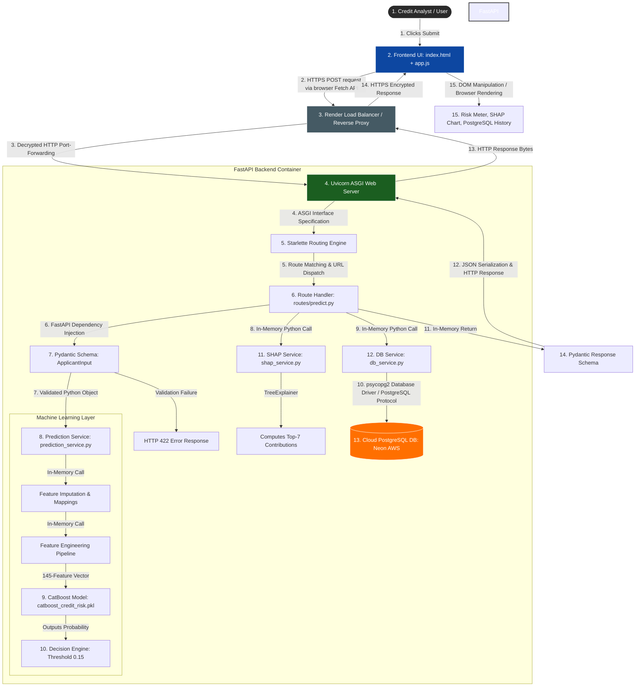

# End-to-End Request Architecture & Data Flow

This document details exactly how data flows through the **Nexus Risk** platform—from the moment a credit analyst interacts with the frontend user interface to the final persistence in the PostgreSQL database and rendering of AI-driven risk insights.

---

## 1. High-Level Architecture Flowchart

---

## 2. Step-by-Step Data Flow Execution Trace

Here is the exact path a single request takes, tracing all files, routers, schemas, and services.

### Step 1: User Submission on the Frontend
* **Action:** The credit analyst fills out the 5-step underwriting wizard on the browser UI (`index.html`) and clicks **Submit**.
* **Code Event:** `app.js` runs `submitUnderwrite(event)`. It gathers all form fields using `getFormValues()`, packages them into a single JavaScript object, and executes a `fetch` call sending an HTTP `POST` request to `https://credit-card-default-3xnc.onrender.com/api/predict` with the JSON payload.

### Step 2: Server Interface (Uvicorn & Starlette)
* **Action:** The HTTP request arrives at the Render cloud server where **Uvicorn** (the ASGI web server) is listening on the network port.
* **Code Event:** Uvicorn parses the incoming TCP bytes into an ASGI request stream and hands it to **Starlette** (FastAPI’s routing core). Starlette scans the registered routers in `main.py` and matches the request path `/api/predict` to the `predict_endpoint` handler in `backend/routes/predict.py`.

### Step 3: Request Validation (Pydantic Schema)
* **Action:** Before running any model logic, the server checks if the incoming data is valid and clean.
* **Code Event:** The endpoint definition specifies `body: ApplicantInput`. FastAPI hands the incoming JSON data to the **Pydantic model** `ApplicantInput` defined in `backend/schemas/applicant.py`.
  * **If invalid:** (e.g. `income` is a text string like `"rich"` instead of a number), Pydantic fails validation immediately and sends an HTTP `422 Unprocessable Entity` response back to the client.
  * **If valid:** Pydantic converts the JSON dictionary into a clean Python object with correct types and standard defaults.

### Step 4: Machine Learning Inference (Prediction Service)
* **Action:** The backend processes the variables and scores the applicant.
* **Code Event:** The route handler calls `predict(inputs)` inside `backend/services/prediction_service.py`.
  1. **Imputation:** It reads `feature_defaults.json`. Any optional features the user left blank are filled in with the training-set medians.
  2. **Encoding:** Categorical fields (like `education` or `housing`) are mapped to numeric values using `category_mappings.json`.
  3. **Feature Engineering:** It handcrafts ratio features (e.g. `dti` = debt / income, `ltv` = loan / assets) and binds them with historical bureau aggregations, forming a structured 145-column row.
  4. **Model Score:** The 145-vector is fed into the loaded **CatBoost** model (`catboost_credit_risk.pkl`). The model outputs a raw probability score (between 0.0 and 1.0).
  5. **Decision Engine:** If the default probability is $\ge 0.15$, the decision is flagged as **REJECTED** (due to high default risk). If it falls between the safety gates ($0.45 - 0.55$), it flags it as **UNCERTAIN** (manual review). Otherwise, it is **APPROVED**.

### Step 5: Explainability (SHAP Service)
* **Action:** The system determines *why* the model made that decision.
* **Code Event:** The route handler calls `compute_shap(df_pred, row)` in `backend/services/shap_service.py`. It initializes a SHAP `TreeExplainer` on the CatBoost model. It calculates the SHAP values, sorts them, and extracts the top 7 factors that contributed most to increasing or decreasing this specific applicant's default probability.

### Step 6: Persistent Logging (DB Service)
* **Action:** The transaction is permanently logged.
* **Code Event:** The route handler calls `save_prediction(inputs, result)` in `backend/services/db_service.py`.
  * The service opens a connection to the **Neon PostgreSQL** database.
  * It executes a SQL `INSERT INTO predictions (...) VALUES (...) RETURNING id` query.
  * This stores the timestamp, full applicant inputs, default probabilities, and decisions in the cloud. It returns the database auto-incremented primary key (`id`), which is sent back to the frontend.

### Step 7: Response & UI Update
* **Action:** The frontend receives the response and renders the dashboard.
* **Code Event:** The FastAPI backend packs the results into the `ApplicantResponse` Pydantic schema, converting the Python dictionaries into a clean JSON string, and sends it back to `app.js` with an HTTP `200 OK` status.
* **Rendering:** `app.js` updates the screen:
  * Animates the needle on the **Risk Indicator Meter**.
  * Renders the **SHAP horizontal bar chart** (using Red for risk factors, Green for positive factors).
  * Switches the view to the main **Underwriting Dashboard**.
